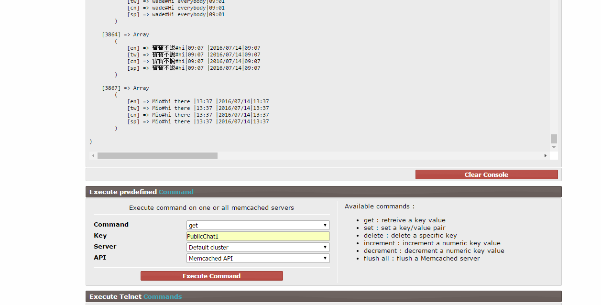

# 聊天室壞掉刪除特定留言

發生原因:不當操作API,存入memcached後client用get_chat API所回傳的資料格式不符預期.

解決方法:

1.使用查詢錯誤資料的聊天ID

  查詢網址:
  http://54.67.46.158/Temptation/test/lib/phpMemcachedAdmin/commands.php
  指令如圖,選好後按下 Excute Command

查詢後可以看見該聊天資料格式
正常如下:
```
    [3867] => Array
        (
            [en] => Mio#hi there |13:37 |2016/07/14|13:37
            [tw] => Mio#hi there |13:37 |2016/07/14|13:37
            [cn] => Mio#hi there |13:37 |2016/07/14|13:37
            [sp] => Mio#hi there |13:37 |2016/07/14|13:37
        )

```
若此陣列格式不正確,會造成client無法正常聊天.

2.刪除特定聊天ID

刪除網址:

http://54.67.46.158/Temptation/test/api/tool/test_tool_test/test_win.php?path=../character_chat&name=chat_delete_byId

輸入該陣列id後按下確定即可刪除